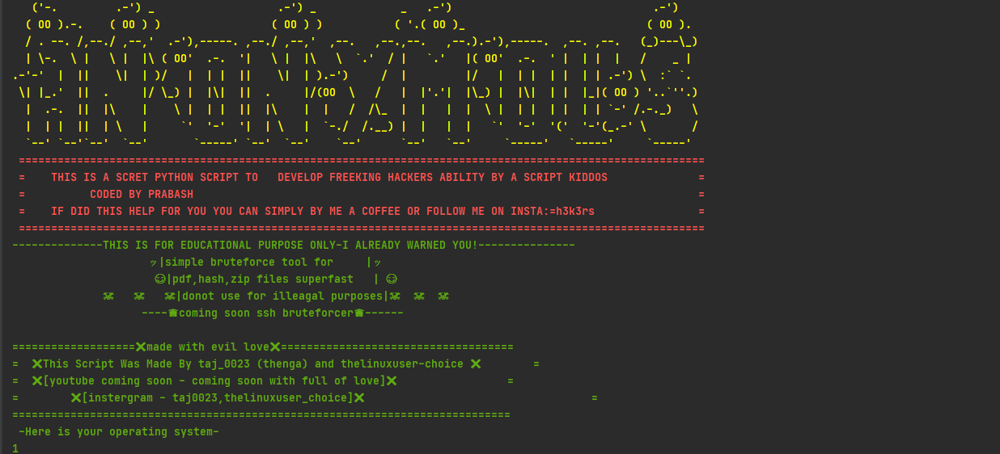
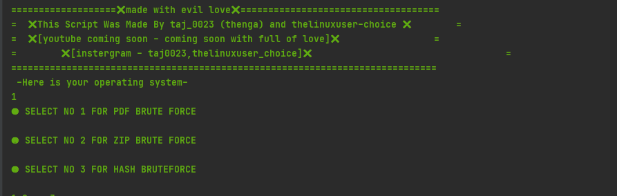

###ANON CRACKER SIMPLE POWERFUL BRUTEFORCE TOOL 
### PLS READ ERROR FIXING SECTION AND RUN
==========================================

    

    

    

- 🔭 simple and fast bruteforce for pdf , zip and hashes
- 🌱 script written  **Python**
- 🤔 credits [@taj0023](https://github.com/taj0023) for awesome support
### Installation
- **git clone https://github.com/thelinuxuser-choice/AnonCracker.git***
- ***cd BRUT3R*** 
- ***pip  install -r requirements.txt***
- **python3 AnonCracker.py***
### error fixing  
if requirements wont work use it manually by-be sure you have pip
(install pip with = **apt-get install python3-pip**)
- **pip install pikepdf**
- **pip install hashlib***
- ****important paste your pdf,zip in to BRUT3X folder and wordlist into BRUT3x folder and run otherwise it will not run the attack****
- 📫 How to reach me:  [@Instagram](https://www.instagram.com/h3k3rs/)
### WARNING!
⚡ ***ANON CRACKER***:
\\***use at your own risk donot use for illeagal activities***//

### Languages and Tools:

 

 
    

